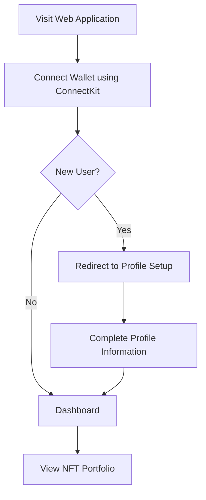
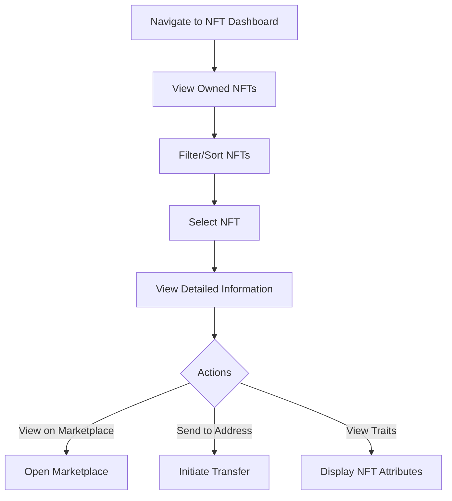
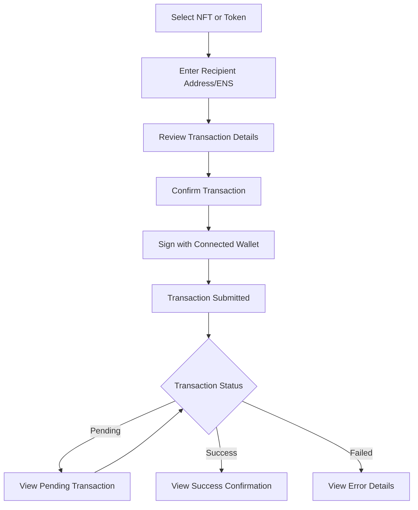

# Web3 NFT Wallet Application

A full-stack web3 application for connecting crypto wallets, viewing NFTs, and sending blockchain assets. Built with Next.js, NestJS, and PostgreSQL in a monorepo structure.

## Features

- Wallet connection using various web3 providers
- NFT portfolio viewing and management
- Secure blockchain asset transfers
- User authentication and profile management

## Repository Structure

This project is organized as a monorepo using Turborepo and PNPM:

```
├── apps
│   ├── api         # NestJS backend API service
│   └── web         # Next.js frontend application
├── packages
│   ├── eslint-config       # Shared ESLint configuration
│   ├── typescript-config   # Shared TypeScript configuration
│   └── ui                  # Shared UI components
├── services
│   └── postgres            # PostgreSQL database service
└── Makefile                # Automation for local and Docker setups
```

## Technologies

### Backend (API)
- NestJS - Progressive Node.js framework
- Prisma - Next-generation ORM for Node.js and TypeScript
- PostgreSQL - Open-source relational database
- Docker - Containerization

### Frontend (Web)
- Next.js - React framework with SSR and SSG capabilities
- React - JavaScript library for building user interfaces
- TailwindCSS - Utility-first CSS framework
- wagmi/viem - Ethereum React hooks
- ConnectKit - Wallet connection library

### Development & Deployment
- Turborepo - Monorepo tooling
- PNPM - Fast, disk space efficient package manager
- Docker & docker-compose - Container orchestration
- Make - Build automation tool

## Getting Started

### Prerequisites

- Node.js v18 or higher
- PNPM package manager
- Docker and docker-compose (for containerized setup)
- A wallet with some test ETH on a testnet (for full functionality)

### Environment Setup

1. Clone the repository:
   ```bash
   git clone <repository-url>
   cd <repository-name>
   ```

2. Install dependencies:
   ```bash
   pnpm install
   ```

3. Set up environment files using Make:
   
   For local development:
   ```bash
   make setup-env-local
   ```
   
   For Docker setup:
   ```bash
   make setup-env-docker
   ```

## Running Locally

### Using Make (Recommended)

The project includes a comprehensive Makefile to simplify development workflows:

1. Start all services (PostgreSQL + PgAdmin):
   ```bash
   make services-up
   ```

2. Set up the database and run migrations:
   ```bash
   make db-setup
   make db-migrate-dev
   ```

3. Start the development servers:
   ```bash
   # From root directory
   pnpm dev
   ```

### Manual Setup

1. Start the PostgreSQL database:
   ```bash
   cd services/postgres
   docker-compose up -d
   ```

2. Apply Prisma migrations:
   ```bash
   cd apps/api
   pnpm prisma:migrate-dev
   ```

3. Start the development servers:
   ```bash
   # From root directory
   pnpm dev
   ```

   This will concurrently start:
   - API server on http://localhost:3001
   - Web application on http://localhost:3000

## Running with Docker
### Using Make (Recommended)

1. Build and start all containers:
   ```bash
   make up-build
   ```

   This command:
   - Sets up environment files
   - Starts PostgreSQL and PgAdmin
   - Builds and starts API container
   - Runs database migrations
   - Builds and starts Web container

2. Stop all containers:
   ```bash
   make down
   ```

3. Clean up everything (including volumes):
   ```bash
   make clean
   ```

### Manual Docker Setup

1. Start all services using docker-compose:
   ```bash
   docker-compose up -d
   ```

   This will build and start:
   - PostgreSQL database on port 5432
   - API service on port 3001 (or 4000 as per Makefile)
   - Web application on port 3000

2. View logs:
   ```bash
   docker-compose logs -f
   ```

3. Stop all services:
   ```bash
   docker-compose down
   ```

## Makefile Commands

The repository includes a comprehensive Makefile to simplify development workflows:

| Command | Description |
|---------|-------------|
| `make setup-env-local` | Set up environment files from examples for local development |
| `make setup-env-docker` | Set up environment files from Docker examples |
| `make services-up` | Start all services (PostgreSQL + PgAdmin) |
| `make services-up-build` | Rebuild and start all services |
| `make db-setup` | Generate Prisma client and set up database schema |
| `make db-migrate` | Run database migrations (production) |
| `make db-migrate-dev` | Run database migrations (development) |
| `make up` | Start API and Web containers (also starts database) |
| `make up-build` | Build and start all containers (API, Web, and database) |
| `make down` | Stop all containers |
| `make clean` | Clean up development environment completely (including volumes) |
| `make help` | Display help information for all available commands |

## Application Architecture

### Data Flow

1. **User Authentication**:
   - User connects their wallet through the web frontend
   - The wallet address is sent to the API for authentication
   - API verifies the wallet signature and issues a session token
   - Frontend stores the token for subsequent requests

2. **NFT Data Retrieval**:
   - Frontend requests NFT data from the API
   - API fetches NFT metadata from blockchain and external sources
   - Data is cached in PostgreSQL for improved performance
   - Processed NFT data is returned to the frontend for display

3. **Asset Transfers**:
   - User initiates a transfer from the web interface
   - Frontend prepares the transaction with the connected wallet
   - User confirms and signs the transaction
   - Transaction hash is sent to API for tracking
   - API monitors transaction status and updates the database

### Database Schema

The application uses PostgreSQL with Prisma ORM to manage:
- User profiles and wallet addresses
- NFT metadata and ownership information
- Transaction history and status

## User Workflows

### New User Onboarding



### Viewing NFTs



### Sending Assets



## Development

### Available Scripts

- `pnpm dev` - Start all applications in development mode
- `pnpm build` - Build all applications
- `pnpm lint` - Run linting on all packages
- `pnpm test` - Run tests across the monorepo

### Adding a New Package

1. Create a new directory in the appropriate location
2. Initialize with `pnpm init`
3. Add to workspace in root `package.json`
4. Install dependencies with `pnpm add <package> --filter <your-package-name>`

## Contributing

1. Fork the repository
2. Create your feature branch (`git checkout -b feature/amazing-feature`)
3. Commit your changes (`git commit -m 'Add some amazing feature'`)
4. Push to the branch (`git push origin feature/amazing-feature`)
5. Open a Pull Request

## License

This project is licensed under the MIT License - see the LICENSE file for details.
