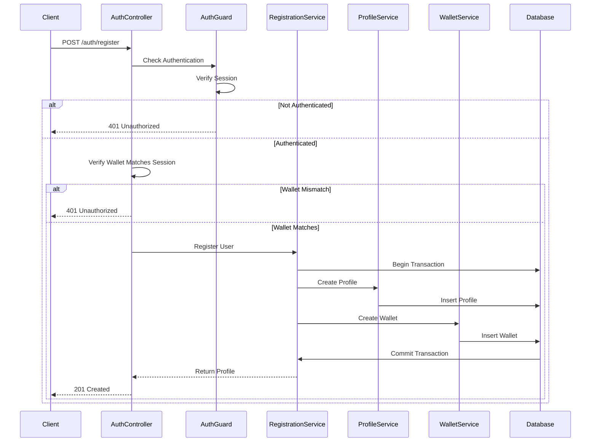

```mermaid
sequenceDiagram
    participant Client
    participant AuthController
    participant AuthGuard
    participant RegistrationService
    participant ProfileService
    participant WalletService
    participant Database

    Client->>AuthController: POST /auth/register
    AuthController->>AuthGuard: Check Authentication
    AuthGuard->>AuthGuard: Verify Session
    
    alt Not Authenticated
        AuthGuard-->>Client: 401 Unauthorized
    else Authenticated
        AuthController->>AuthController: Verify Wallet Matches Session
        
        alt Wallet Mismatch
            AuthController-->>Client: 401 Unauthorized
        else Wallet Matches
            AuthController->>RegistrationService: Register User
            RegistrationService->>Database: Begin Transaction
            
            RegistrationService->>ProfileService: Create Profile
            ProfileService->>Database: Insert Profile
            
            RegistrationService->>WalletService: Create Wallet
            WalletService->>Database: Insert Wallet
            
            Database->>RegistrationService: Commit Transaction
            RegistrationService-->>AuthController: Return Profile
            AuthController-->>Client: 201 Created
        end
    end
```

