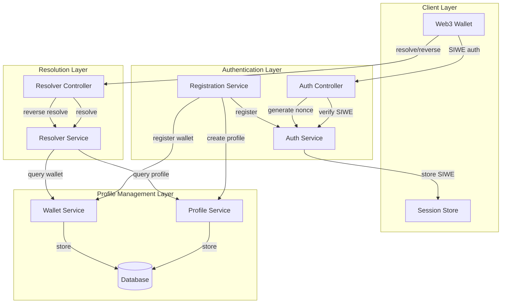

```mermaid 
    flowchart TD
        %% Client Layer
        subgraph Client[Client Layer]
            wallet[Web3 Wallet]
            session[Session Store]
        end

        %% Authentication Layer
        subgraph Auth[Authentication Layer]
            direction TB
            authC[Auth Controller]
            authS[Auth Service]
            regS[Registration Service]
            
            authC -->|verify SIWE| authS
            authC -->|generate nonce| authS
            authS -->|store SIWE| session
            regS -->|register| authS
        end

        %% Profile Management Layer
        subgraph Profile[Profile Management Layer]
            direction TB
            profS[Profile Service]
            walletS[Wallet Service]
            
            profS -->|store| db[(Database)]
            walletS -->|store| db
            regS -->|create profile| profS
            regS -->|register wallet| walletS
        end

        %% Resolution Layer
        subgraph Resolver[Resolution Layer]
            direction TB
            resolverC[Resolver Controller]
            resolverS[Resolver Service]
            
            resolverC -->|resolve| resolverS
            resolverC -->|reverse resolve| resolverS
            resolverS -->|query profile| profS
            resolverS -->|query wallet| walletS
        end

        %% External Interactions
        wallet -->|SIWE auth| authC
        wallet -->|resolve/reverse| resolverC
```