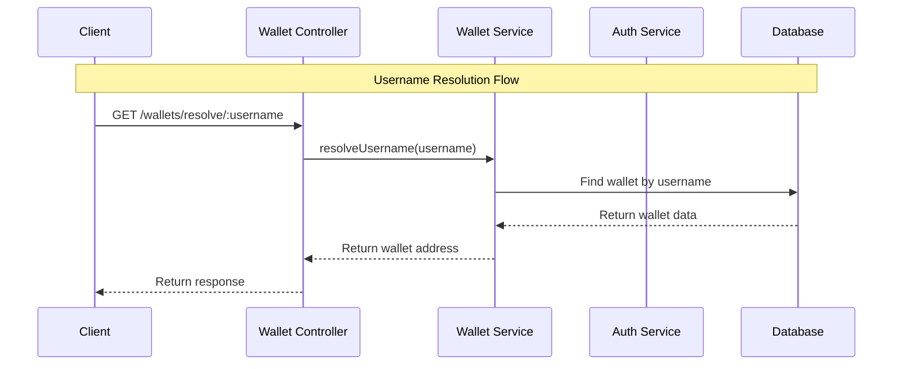
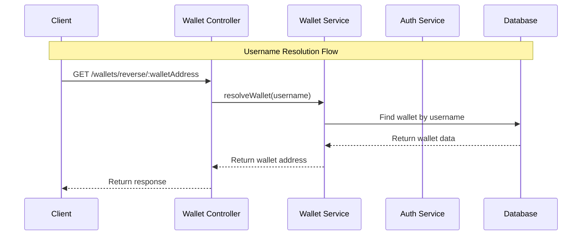

```mermaid
sequenceDiagram
    participant C as Client
    participant W as Wallet Controller
    participant WS as Wallet Service
    participant A as Auth Service
    participant D as Database
    
    Note over C,D: Username Resolution Flow
    C->>W: GET /wallets/resolve/:username
    W->>WS: resolveUsername(username)
    WS->>D: Find wallet by username
    D-->>WS: Return wallet data
    WS-->>W: Return wallet address
    W-->>C: Return response
```

```mermaid
sequenceDiagram
    participant C as Client
    participant W as Wallet Controller
    participant WS as Wallet Service
    participant A as Auth Service
    participant D as Database
    
    Note over C,D: Username Resolution Flow
    C->>W: GET /wallets/reverse/:walletAddress
    W->>WS: resolveWallet(username)
    WS->>D: Find wallet by username
    D-->>WS: Return wallet data
    WS-->>W: Return wallet address
    W-->>C: Return response
```