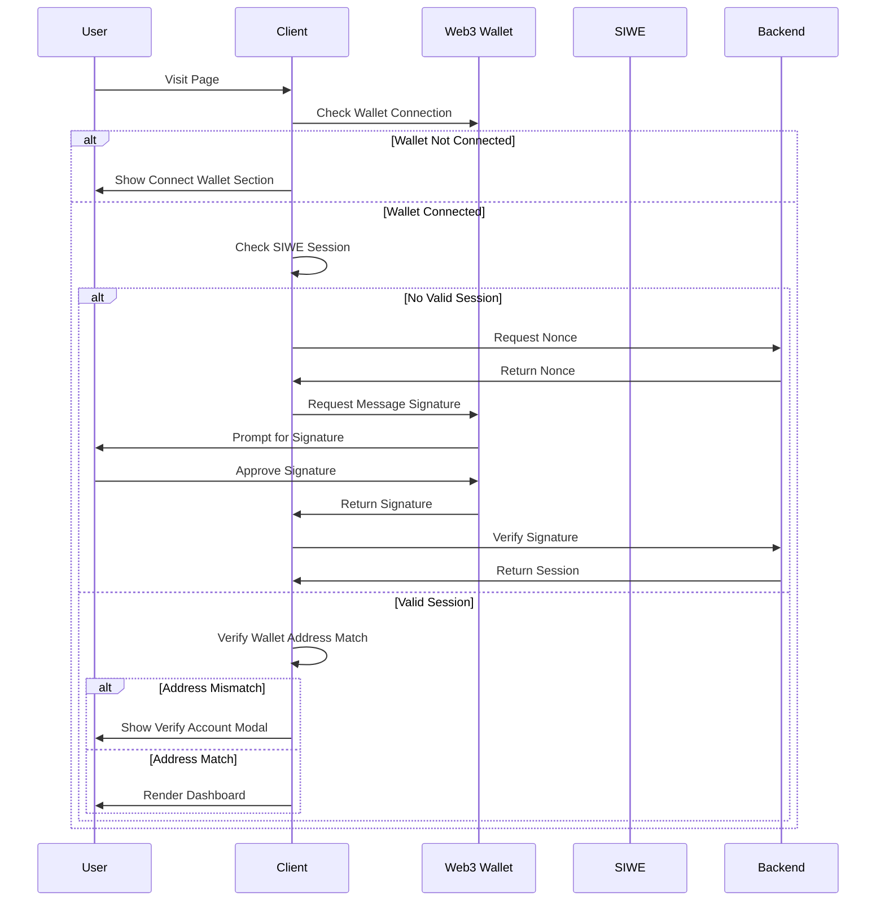

```mermaid
sequenceDiagram
    participant U as User
    participant C as Client
    participant W as Web3 Wallet
    participant S as SIWE
    participant B as Backend

    U->>C: Visit Page
    C->>W: Check Wallet Connection
    alt Wallet Not Connected
        C->>U: Show Connect Wallet Section
    else Wallet Connected
        C->>C: Check SIWE Session
        alt No Valid Session
            C->>B: Request Nonce
            B->>C: Return Nonce
            C->>W: Request Message Signature
            W->>U: Prompt for Signature
            U->>W: Approve Signature
            W->>C: Return Signature
            C->>B: Verify Signature
            B->>C: Return Session
        else Valid Session
            C->>C: Verify Wallet Address Match
            alt Address Mismatch
                C->>U: Show Verify Account Modal
            else Address Match
                C->>U: Render Dashboard
            end
        end
    end
```
